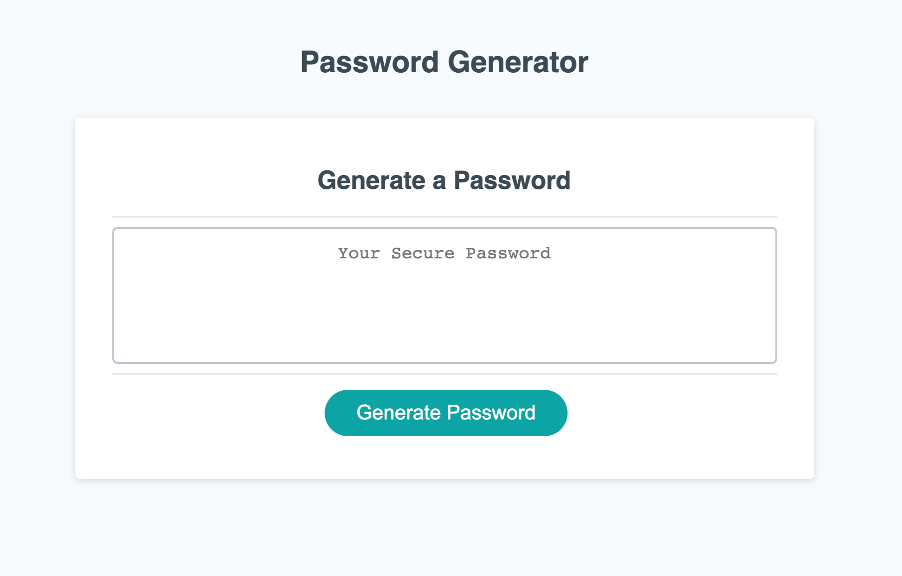

# Password generator

This is a password generator. The application allows the user to generate a random password between 8 and 128 characters by selecting from a combination of any of the following criteria. 

Uppercase letters
Lowercase letters
Numbers
Special characters

## Technology

The website was built using HTML, CSS and Javascript. 

## Pages

Single responsive page containing the generator UI

## Contributing

Pull requests are welcome, but should be limited to improving the layout and styles. No special software is required to clone and run the website other than a basic code editor and a browser of choice. 

## License

MIT